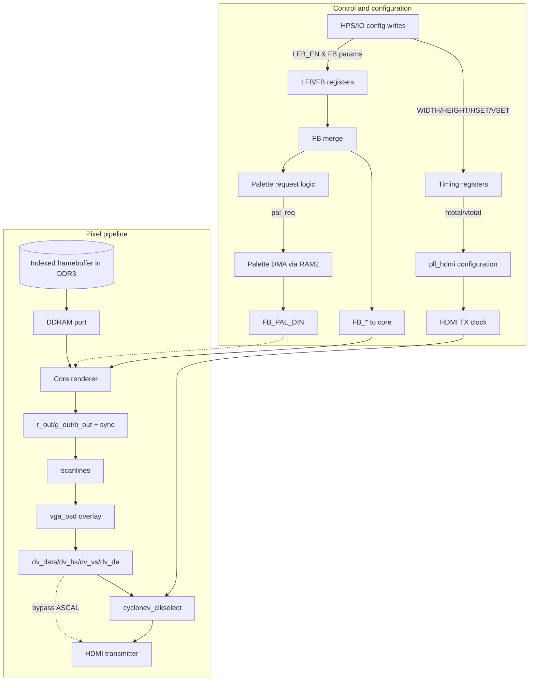

# Video Flow Diagrams

## MyCore video demo data and control flow

```mermaid
flowchart LR
    subgraph Wrapper["`emu` wrapper (mycore.sv)"]
        HPS_BUS[[HPS\_BUS]] --> HPSIO[hps_io]
        HPSIO -->|status[2], buttons[1]| ResetMux[Reset logic]
        HPSIO -->|status[122:121]| Aspect[VIDEO_ARX/VIDEO_ARY]
        HPSIO -->|status[4:3]| ColorMask[RGB channel mask]
        HPSIO -->|forced_scandoubler| ScanCtrl[Scan doubler request]
        CLK50[CLK_50M] --> PLL[pll]
        PLL --> clk_sys[clk_sys]
        ResetMux --> MycoreInst((mycore))
        clk_sys --> CLK_VIDEO
        clk_sys --> MycoreInst
        ScanCtrl --> MycoreInst
        statusPAL[status[2] (PAL mode)] --> MycoreInst
    end

    subgraph DemoCore["`mycore` internals (rtl/mycore.v)"]
        MycoreInst -->|ce_pix| CE_PIXEL
        MycoreInst -->|HBlank/HSync/VBlank/VSync| Timing[VGA timing]
        MycoreInst -->|video[7:0]| Luma[Luminance]
        clk_sys --> PixelCounter[Pixel counters]
        ScanCtrl --> PixelCounter
        statusPAL --> PixelCounter
        PixelCounter --> Timing
        PixelCounter --> PhaseAcc[vvc accumulator]
        PhaseAcc --> CosineROM[cos LUT]
        CosineROM --> Cosine[Cosine wave]
        LFSR[lfsr noise] --> Noise[Random comparator]
        Cosine --> Mixer[Threshold mixer]
        Noise --> Mixer
        Mixer --> Luma
    end

    CE_PIXEL --> CEOut[CE_PIXEL output]
    Timing -->|sync| VGASync[VGA_HS/VGA_VS/VGA_DE]
    Luma --> ColorMux[Channel routing]
    ColorMask --> ColorMux
    ColorMux --> VGA_RGB[VGA_R/VGA_G/VGA_B]
    Aspect --> VIDEO_AR[Aspect ratio outputs]
```

## 1440p HDMI from indexed palette framebuffer without ASCAL


